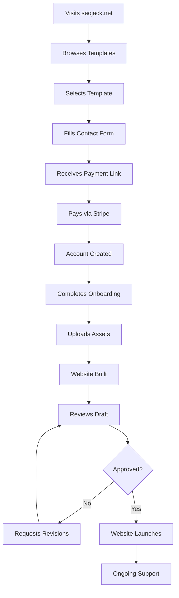
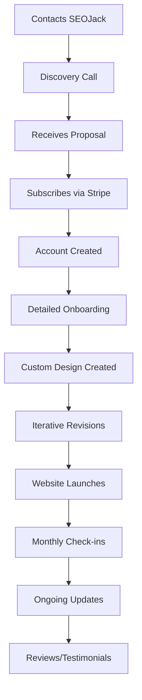
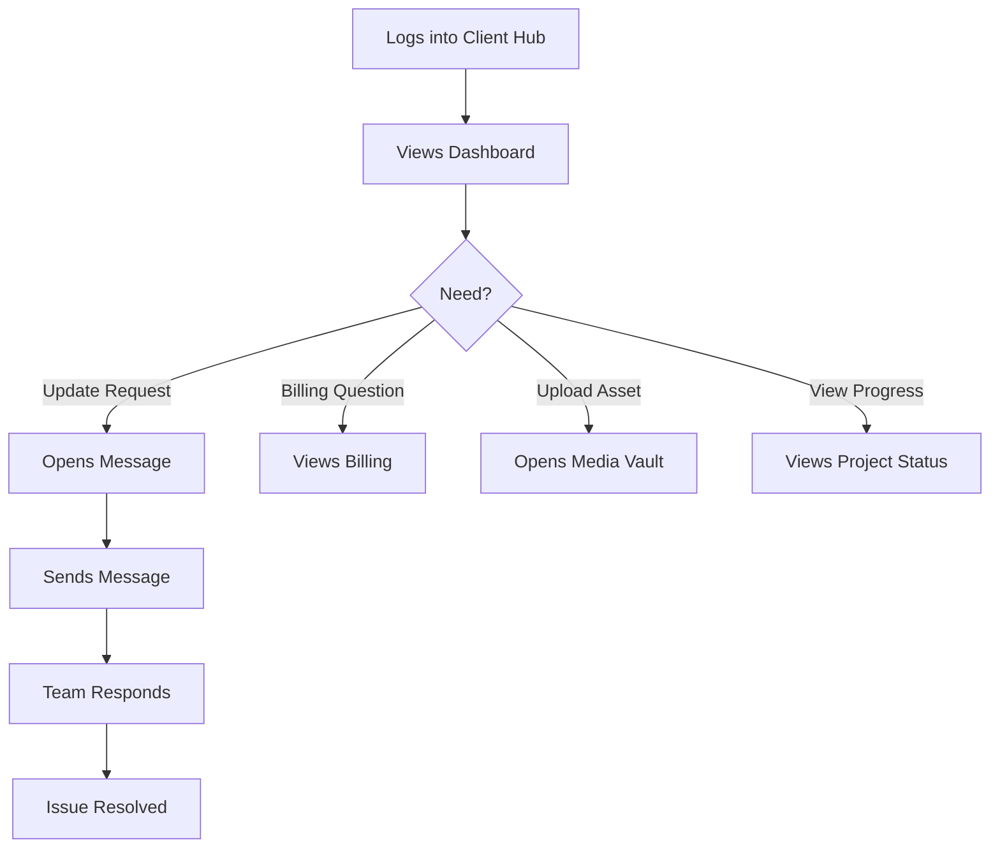

# SEOJack Client Hub - CRM Blueprint
> **Version**: 1.0 | **Last Updated**: November 28, 2025
> **Domain**: login.seojack.space | **Codename**: Client Hub

---

## 📋 Table of Contents

1. [Executive Summary](#-executive-summary)
2. [Current State Analysis](#-current-state-analysis)
3. [Vision & Goals](#-vision--goals)
4. [User Roles & Permissions](#-user-roles--permissions)
5. [Core Features (Must Have)](#-core-features-must-have)
6. [Enhanced Features (Should Have)](#-enhanced-features-should-have)
7. [Future Features (Nice to Have)](#-future-features-nice-to-have)
8. [User Journeys](#-user-journeys)
9. [Data Models](#-data-models)
10. [Technical Architecture](#-technical-architecture)
11. [UI/UX Guidelines](#-uiux-guidelines)
12. [Integration Points](#-integration-points)
13. [Security & Compliance](#-security--compliance)
14. [Implementation Phases](#-implementation-phases)
15. [Success Metrics](#-success-metrics)

---

## 🎯 Executive Summary

### What is the Client Hub?

The SEOJack Client Hub is a **client-facing portal** where customers can:
- View and manage their website project
- Communicate with the SEOJack team
- Upload brand assets and content
- Track project progress
- Manage billing and subscriptions
- Access their website analytics

### Why Do We Need This?

| Pain Point | Solution |
|------------|----------|
| Scattered communication (email, WhatsApp, etc.) | Centralized messaging system |
| Clients asking "where's my project?" | Real-time project status dashboard |
| Manually collecting assets via email | Self-service media upload vault |
| Billing questions and invoice chaos | Integrated billing management |
| No visibility for clients | Transparent progress tracking |

### The Business Impact

```
Before: Manual processes, scattered tools, poor client experience
After:  Automated workflows, professional portal, delighted clients
        → Higher retention
        → More referrals  
        → Less support overhead
```

---

## 📊 Current State Analysis

### ✅ What's Already Built

| Feature | Status | Notes |
|---------|--------|-------|
| **Dashboard** | ✅ Complete | Welcome hero, onboarding CTA |
| **My Website** | ✅ Skeleton | Placeholder for website preview |
| **Messages** | ✅ UI Complete | Chat interface built, needs backend |
| **Media Vault** | 🔶 Backend Only | Upload system exists, no dashboard UI |
| **Billing** | ✅ UI Complete | Subscription display, needs Stripe integration |
| **Settings** | ❌ 404 | Page doesn't exist |
| **Onboarding** | ⚠️ Broken | Firebase auth error |
| **Auth System** | ✅ Complete | Firebase Authentication |

### 🛠️ Current Tech Stack

- **Frontend**: Next.js 16 (App Router), React, TypeScript, Tailwind CSS
- **Auth**: Firebase Authentication
- **Database**: Firestore
- **Storage**: Cloudflare R2
- **AI**: Google Gemini (for metadata generation)
- **Hosting**: Vercel

### 📁 Current Data Models

```typescript
// Media files (existing)
MediaFile, Folder, SeoMetadata

// Missing models
Client, Project, Message, Invoice, OnboardingData
```

---

## 🚀 Vision & Goals

### The North Star

> "A client portal so good that customers feel like they have a dedicated web team at their fingertips."

### Primary Goals

1. **Reduce Support Overhead** - Self-service answers 80% of questions
2. **Improve Client Satisfaction** - Professional experience builds trust
3. **Increase Retention** - Engaged clients stay longer
4. **Streamline Operations** - Automated workflows save time
5. **Enable Upselling** - Easy upgrade paths drive revenue

### Success Looks Like

```
Client signs up → Completes onboarding → Uploads assets → 
Tracks progress → Reviews drafts → Approves launch →
Gets updates → Stays subscribed → Refers friends
```

---

## 👥 User Roles & Permissions

### Role: Client (Default)

| Permission | Access |
|------------|--------|
| View own dashboard | ✅ |
| View project status | ✅ |
| Send/receive messages | ✅ |
| Upload media | ✅ |
| View/download own media | ✅ |
| View billing & invoices | ✅ |
| Update payment method | ✅ |
| Cancel subscription | ✅ |
| Update profile/settings | ✅ |
| Access other clients' data | ❌ |

### Role: Admin (Internal - Future)

| Permission | Access |
|------------|--------|
| View all clients | ✅ |
| Manage all projects | ✅ |
| Send messages as "SEOJack Support" | ✅ |
| Update project status | ✅ |
| Create invoices | ✅ |
| Access analytics | ✅ |
| Manage templates | ✅ |

### Role: Super Admin (You)

All Admin permissions plus:
- Manage admin users
- System configuration
- Billing settings
- Feature flags

---

## ✅ Core Features (Must Have)

### 1. 🏠 Dashboard (Home)

**Purpose**: Central hub showing client's project status at a glance

**Components**:
```
┌─────────────────────────────────────────────────────────┐
│  Welcome back, [Name]!                    [Notifications]│
├─────────────────────────────────────────────────────────┤
│                                                         │
│  ┌─────────────────┐  ┌─────────────────┐              │
│  │ PROJECT STATUS  │  │ QUICK ACTIONS   │              │
│  │ ───────────────│  │ ───────────────│              │
│  │ 🎨 Design Phase │  │ • Upload Media  │              │
│  │ Progress: 60%   │  │ • Send Message  │              │
│  │ ETA: Dec 5      │  │ • View Invoice  │              │
│  └─────────────────┘  └─────────────────┘              │
│                                                         │
│  ┌─────────────────────────────────────────────────────┐│
│  │ RECENT ACTIVITY                                     ││
│  │ • Design Team sent a message (2h ago)               ││
│  │ • You uploaded 3 photos (yesterday)                 ││
│  │ • Invoice #1234 paid (Nov 25)                       ││
│  └─────────────────────────────────────────────────────┘│
│                                                         │
│  ┌─────────────────────────────────────────────────────┐│
│  │ 💬 NEED HELP?                          [Open Chat]  ││
│  └─────────────────────────────────────────────────────┘│
└─────────────────────────────────────────────────────────┘
```

**Data Required**:
- User profile (name, business name)
- Project status (phase, progress %, ETA)
- Recent activity feed
- Unread message count

---

### 2. 🌐 My Website

**Purpose**: View website preview, status, and deployment info

**States**:

**State A: Pre-Build (Onboarding)**
```
┌─────────────────────────────────────────────────────────┐
│  MY WEBSITE                                             │
├─────────────────────────────────────────────────────────┤
│                                                         │
│  ┌─────────────────────────────────────────────────────┐│
│  │     🚀 Let's build your dream website!              ││
│  │                                                     ││
│  │     Complete onboarding to get started              ││
│  │                                                     ││
│  │     [Start Onboarding]  [Talk to Expert]            ││
│  └─────────────────────────────────────────────────────┘│
│                                                         │
└─────────────────────────────────────────────────────────┘
```

**State B: In Progress**
```
┌─────────────────────────────────────────────────────────┐
│  MY WEBSITE                                             │
├─────────────────────────────────────────────────────────┤
│                                                         │
│  Project: Acme Plumbing Website                         │
│  Status: 🎨 Design Phase                               │
│                                                         │
│  ┌─────────────────────────────────────────────────────┐│
│  │  PROGRESS                                           ││
│  │  ═══════════════════════░░░░░░░░░░  60%             ││
│  │                                                     ││
│  │  ✅ Onboarding Complete                             ││
│  │  ✅ Assets Collected                                ││
│  │  🔄 Design In Progress                              ││
│  │  ⏳ Development                                     ││
│  │  ⏳ Review & Launch                                 ││
│  └─────────────────────────────────────────────────────┘│
│                                                         │
│  Estimated Launch: December 5, 2025                     │
│                                                         │
│  [View Design Draft]  [Request Changes]                 │
│                                                         │
└─────────────────────────────────────────────────────────┘
```

**State C: Live**
```
┌─────────────────────────────────────────────────────────┐
│  MY WEBSITE                           [Visit Site ↗]   │
├─────────────────────────────────────────────────────────┤
│                                                         │
│  ┌─────────────────────────────────────────────────────┐│
│  │  [Website Preview Iframe or Screenshot]             ││
│  │                                                     ││
│  │      www.acmeplumbing.com                          ││
│  │                                                     ││
│  └─────────────────────────────────────────────────────┘│
│                                                         │
│  ┌──────────────┐ ┌──────────────┐ ┌──────────────┐    │
│  │ Visitors     │ │ This Week    │ │ Status       │    │
│  │ 1,234        │ │ +12%         │ │ 🟢 Online    │    │
│  └──────────────┘ └──────────────┘ └──────────────┘    │
│                                                         │
│  [Request Update]  [View Analytics]  [Download Backup]  │
│                                                         │
└─────────────────────────────────────────────────────────┘
```

---

### 3. 💬 Messages

**Purpose**: Real-time communication between client and SEOJack team

**Features**:
- Threaded conversations
- File/image attachments
- Read receipts
- Typing indicators
- Push notifications
- Email fallback (if not logged in)

**UI Structure** (Already Built):
```
┌─────────────────────────────────────────────────────────┐
│  MESSAGES                                               │
├─────────────────────────────────────────────────────────┤
│  ┌─────────────┐  ┌─────────────────────────────────────┐│
│  │ INBOX       │  │ SEOJack Support           🟢 Online ││
│  │             │  │─────────────────────────────────────││
│  │ [Support]●  │  │                                     ││
│  │ [Design] 2  │  │ Hi! I saw you uploaded the logo.   ││
│  │             │  │ Looks great! Do you want purple    ││
│  │             │  │ or blue as the primary color?      ││
│  │             │  │                            10:23 AM ││
│  │             │  │                                     ││
│  │             │  │─────────────────────────────────────││
│  │             │  │ [📎] Type a message...    [😊] [➤] ││
│  └─────────────┘  └─────────────────────────────────────┘│
└─────────────────────────────────────────────────────────┘
```

**Backend Requirements**:
- Firestore real-time listeners
- Cloud Functions for notifications
- Email integration (SendGrid/Resend)

---

### 4. 📁 Media Vault

**Purpose**: Central repository for all client brand assets

**Features**:
- Drag & drop upload
- Automatic WebP conversion
- AI-powered metadata (Gemini)
- Folder organization
- Bulk actions
- Search & filter
- Download originals

**UI Structure**:
```
┌─────────────────────────────────────────────────────────┐
│  MEDIA VAULT                           [+ Upload]       │
├─────────────────────────────────────────────────────────┤
│  [All] [Images] [Documents] [Videos]     🔍 Search      │
├─────────────────────────────────────────────────────────┤
│                                                         │
│  📁 Logo Files (4)                                      │
│  ┌─────┐ ┌─────┐ ┌─────┐ ┌─────┐                       │
│  │ 🖼️ │ │ 🖼️ │ │ 🖼️ │ │ 🖼️ │                       │
│  │logo │ │logo │ │logo │ │icon │                       │
│  │.png │ │dark │ │white│ │.svg │                       │
│  └─────┘ └─────┘ └─────┘ └─────┘                       │
│                                                         │
│  📁 Photos (12)                                         │
│  ┌─────┐ ┌─────┐ ┌─────┐ ┌─────┐ ┌─────┐ ...          │
│  │ 📷 │ │ 📷 │ │ 📷 │ │ 📷 │ │ 📷 │                  │
│  └─────┘ └─────┘ └─────┘ └─────┘ └─────┘               │
│                                                         │
│  Storage: 1.2 GB / 5 GB                                 │
│  ═══════════════░░░░░░░░░░░░░░░░░░░░░  24%             │
└─────────────────────────────────────────────────────────┘
```

**Backend** (Mostly Built):
- R2 storage integration ✅
- Upload API routes ✅
- Gemini metadata generation ✅
- Need: Dashboard UI integration

---

### 5. 💳 Billing

**Purpose**: Subscription management, invoices, payment methods

**Features**:
- Current plan display
- Usage metrics
- Payment method management
- Invoice history
- Upgrade/downgrade
- Cancel subscription

**UI Structure** (Partially Built):
```
┌─────────────────────────────────────────────────────────┐
│  BILLING & SUBSCRIPTION                                 │
├─────────────────────────────────────────────────────────┤
│                                                         │
│  ┌─────────────────────┐  ┌─────────────────────────┐   │
│  │ CURRENT PLAN        │  │ USAGE                   │   │
│  │ ──────────────────  │  │ ──────────────────────  │   │
│  │ Pro Plan  $127/mo   │  │ Pages: 8/10             │   │
│  │                     │  │ Storage: 1.2GB/5GB      │   │
│  │ Next billing:       │  │ Updates: 3/5 this month │   │
│  │ Dec 15, 2025        │  │                         │   │
│  │                     │  │                         │   │
│  │ [Change Plan]       │  │ [View Details]          │   │
│  └─────────────────────┘  └─────────────────────────┘   │
│                                                         │
│  ┌─────────────────────────────────────────────────────┐│
│  │ PAYMENT METHOD                                      ││
│  │ 💳 Visa ending in 4242          [Update]           ││
│  │ Expires: 12/28                                      ││
│  └─────────────────────────────────────────────────────┘│
│                                                         │
│  ┌─────────────────────────────────────────────────────┐│
│  │ INVOICE HISTORY                                     ││
│  │                                                     ││
│  │ #INV-001  Nov 15, 2025   $127.00   ✅ Paid  [↓]    ││
│  │ #INV-002  Oct 15, 2025   $127.00   ✅ Paid  [↓]    ││
│  │ #INV-003  Sep 15, 2025   $127.00   ✅ Paid  [↓]    ││
│  └─────────────────────────────────────────────────────┘│
│                                                         │
│  [Cancel Subscription]                                  │
└─────────────────────────────────────────────────────────┘
```

**Integrations Needed**:
- Stripe Customer Portal
- Stripe Webhooks
- Invoice PDF generation

---

### 6. ⚙️ Settings

**Purpose**: Account settings, preferences, profile management

**Sections**:

```
┌─────────────────────────────────────────────────────────┐
│  SETTINGS                                               │
├─────────────────────────────────────────────────────────┤
│                                                         │
│  [Profile] [Business] [Notifications] [Security]        │
│                                                         │
│  ══════════════════════════════════════════════════════ │
│                                                         │
│  PROFILE                                                │
│  ┌─────────────────────────────────────────────────────┐│
│  │ Name:     [Alex Johnson                    ]        ││
│  │ Email:    alex@acmeplumbing.com (verified ✅)       ││
│  │ Phone:    [+1 555-123-4567                 ]        ││
│  │ Timezone: [America/New_York            ▼]          ││
│  │                                                     ││
│  │ [Save Changes]                                      ││
│  └─────────────────────────────────────────────────────┘│
│                                                         │
│  BUSINESS DETAILS                                       │
│  ┌─────────────────────────────────────────────────────┐│
│  │ Business Name:  [Acme Plumbing                ]     ││
│  │ Industry:       [Plumbing & HVAC           ▼]      ││
│  │ Website URL:    www.acmeplumbing.com               ││
│  │ Address:        [123 Main St, City, ST     ]       ││
│  └─────────────────────────────────────────────────────┘│
│                                                         │
└─────────────────────────────────────────────────────────┘
```

**Notification Preferences**:
- Email notifications (on/off)
- SMS notifications (future)
- Project updates
- Message alerts
- Billing reminders

**Security**:
- Change password
- Two-factor authentication (future)
- Active sessions
- Delete account

---

### 7. 🚀 Onboarding Wizard

**Purpose**: Guided setup flow for new clients

**Steps**:

```
Step 1: Welcome
┌─────────────────────────────────────────────────────────┐
│                                                         │
│        🎉 Welcome to SEOJack!                          │
│                                                         │
│   Let's get everything set up for your new website.    │
│   This will only take about 5 minutes.                 │
│                                                         │
│                    [Get Started →]                      │
│                                                         │
│   ○───○───○───○───○  Step 1 of 5                       │
└─────────────────────────────────────────────────────────┘

Step 2: Business Info
┌─────────────────────────────────────────────────────────┐
│  Tell us about your business                           │
│                                                         │
│  Business Name *                                        │
│  [                                                  ]   │
│                                                         │
│  Industry *                                             │
│  [Select your industry                          ▼]     │
│                                                         │
│  What services do you offer? *                          │
│  [                                                  ]   │
│  [                                                  ]   │
│  [+ Add another service]                               │
│                                                         │
│  [← Back]                          [Continue →]        │
│                                                         │
│   ●───○───○───○───○  Step 2 of 5                       │
└─────────────────────────────────────────────────────────┘

Step 3: Brand Assets
┌─────────────────────────────────────────────────────────┐
│  Upload your brand assets                               │
│                                                         │
│  Logo (optional)                                        │
│  ┌─────────────────────────────────────────────────────┐│
│  │     📁 Drag & drop your logo here                  ││
│  │        or click to browse                          ││
│  │                                                     ││
│  │     Supports: PNG, SVG, JPG (max 5MB)              ││
│  └─────────────────────────────────────────────────────┘│
│                                                         │
│  Brand Colors (optional)                                │
│  Primary:   [#7C3AED ■]   Secondary: [#1F2937 ■]       │
│                                                         │
│  Don't have a logo? No problem! We can create one.     │
│  [□] Create a logo for me (+$49)                       │
│                                                         │
│  [← Back]                          [Continue →]        │
│                                                         │
│   ●───●───○───○───○  Step 3 of 5                       │
└─────────────────────────────────────────────────────────┘

Step 4: Content
┌─────────────────────────────────────────────────────────┐
│  Tell your story                                        │
│                                                         │
│  Business Description *                                 │
│  Tell us about your business in a few sentences        │
│  ┌─────────────────────────────────────────────────────┐│
│  │                                                     ││
│  │                                                     ││
│  └─────────────────────────────────────────────────────┘│
│                                                         │
│  Contact Information                                    │
│  Phone:   [                    ]                       │
│  Email:   [                    ]                       │
│  Address: [                    ]                       │
│                                                         │
│  Service Areas (optional)                               │
│  [City, State                                    ]      │
│                                                         │
│  [← Back]                          [Continue →]        │
└─────────────────────────────────────────────────────────┘

Step 5: Template Selection (for Pick-A-Template)
┌─────────────────────────────────────────────────────────┐
│  Choose your template                                   │
│                                                         │
│  ┌─────────┐ ┌─────────┐ ┌─────────┐ ┌─────────┐       │
│  │ Modern  │ │ Classic │ │ Bold    │ │ Minimal │       │
│  │ Pro     │ │ Service │ │ Impact  │ │ Clean   │       │
│  │   ✓     │ │         │ │         │ │         │       │
│  └─────────┘ └─────────┘ └─────────┘ └─────────┘       │
│                                                         │
│  Or let us pick the best template for your industry    │
│  [□] Let SEOJack choose for me                         │
│                                                         │
│  [← Back]                          [Complete Setup →]  │
└─────────────────────────────────────────────────────────┘

Step 6: Success
┌─────────────────────────────────────────────────────────┐
│                                                         │
│        🎉 You're all set!                              │
│                                                         │
│   We've received your information and will start       │
│   working on your website right away.                  │
│                                                         │
│   What happens next:                                    │
│   ✅ Our team reviews your info (within 24h)           │
│   ✅ We'll message you with any questions              │
│   ✅ First design draft in 3-5 business days           │
│                                                         │
│                    [Go to Dashboard]                    │
│                                                         │
└─────────────────────────────────────────────────────────┘
```

---

## 🔶 Enhanced Features (Should Have)

### 8. 📊 Analytics Dashboard

**Purpose**: Basic website performance metrics

**Features**:
- Page views (last 7/30 days)
- Visitor count
- Top pages
- Traffic sources
- Device breakdown

**Data Source**: 
- Vercel Analytics API
- Google Analytics integration
- Simple page view tracking

---

### 9. 📋 Project Timeline

**Purpose**: Visual progress tracker with milestones

**Features**:
- Phase-based progress (Onboarding → Design → Development → Launch)
- Estimated vs actual dates
- Milestone completion
- Comments/notes on each phase

```
┌─────────────────────────────────────────────────────────┐
│  PROJECT TIMELINE                                       │
├─────────────────────────────────────────────────────────┤
│                                                         │
│  ✅ Onboarding                              Nov 20      │
│  │  └─ Business info collected                         │
│  │  └─ Assets uploaded                                 │
│  │                                                     │
│  ✅ Design                                  Nov 25      │
│  │  └─ Initial mockup created                          │
│  │  └─ Client approved design ★                        │
│  │                                                     │
│  🔄 Development                             In Progress │
│  │  └─ Building your website...                        │
│  │  └─ ETA: Dec 2                                      │
│  │                                                     │
│  ⏳ Review                                  Dec 3       │
│  │                                                     │
│  ⏳ Launch                                  Dec 5       │
│                                                         │
└─────────────────────────────────────────────────────────┘
```

---

### 10. 📝 Revision Requests

**Purpose**: Structured feedback and change requests

**Features**:
- Screenshot annotation
- Categorized requests (text, image, layout, color)
- Priority levels
- Status tracking (pending, in progress, complete)
- Revision history

```
┌─────────────────────────────────────────────────────────┐
│  REVISION REQUEST                                       │
├─────────────────────────────────────────────────────────┤
│                                                         │
│  What would you like to change?                         │
│                                                         │
│  Page: [Homepage                             ▼]        │
│  Type: [○ Text  ○ Image  ● Color  ○ Layout   ]        │
│                                                         │
│  Description:                                           │
│  ┌─────────────────────────────────────────────────────┐│
│  │ Can we make the header darker? The current color   ││
│  │ is hard to read on mobile.                         ││
│  └─────────────────────────────────────────────────────┘│
│                                                         │
│  Screenshot (optional):                                 │
│  [📎 Attach Image]                                     │
│                                                         │
│  Priority: [○ Low  ● Medium  ○ High]                   │
│                                                         │
│  [Submit Request]                                       │
└─────────────────────────────────────────────────────────┘
```

---

### 11. 🔔 Notification Center

**Purpose**: Centralized notifications with history

**Features**:
- In-app notifications
- Email notifications
- Notification preferences
- Mark as read/unread
- Filter by type

```
┌─────────────────────────────────────────────────────────┐
│  NOTIFICATIONS                         [Mark all read]  │
├─────────────────────────────────────────────────────────┤
│                                                         │
│  Today                                                  │
│  ┌─────────────────────────────────────────────────────┐│
│  │ 💬 New message from SEOJack Support      2h ago  ● ││
│  │ "Hi! Your design draft is ready for review..."     ││
│  └─────────────────────────────────────────────────────┘│
│  ┌─────────────────────────────────────────────────────┐│
│  │ 🎨 Project update: Design phase complete  5h ago  ● ││
│  │ Your website design has been approved...           ││
│  └─────────────────────────────────────────────────────┘│
│                                                         │
│  Yesterday                                              │
│  ┌─────────────────────────────────────────────────────┐│
│  │ 💳 Payment successful                    Nov 27     ││
│  │ Invoice #INV-001 for $127.00 has been paid        ││
│  └─────────────────────────────────────────────────────┘│
│                                                         │
└─────────────────────────────────────────────────────────┘
```

---

### 12. 🎫 Support Tickets

**Purpose**: Formal support requests with tracking

**Features**:
- Create support ticket
- Priority levels
- Status tracking
- Response SLA
- Ticket history

---

## 🌟 Future Features (Nice to Have)

### Phase 3+ Features

| Feature | Description | Priority |
|---------|-------------|----------|
| **Live Chat Widget** | Real-time chat without logging in | Medium |
| **Video Calls** | Built-in video consultation | Low |
| **Content Editor** | Basic CMS for text updates | Medium |
| **SEO Reports** | Monthly automated SEO analysis | Medium |
| **Referral Program** | Refer a friend, get credit | Low |
| **Multi-language** | Support for multiple languages | Low |
| **White Label** | Rebrandable for agencies | Low |
| **Mobile App** | Native iOS/Android apps | Low |
| **AI Assistant** | Chatbot for common questions | Medium |
| **Appointment Booking** | Schedule calls in-portal | Low |
| **Knowledge Base** | Self-service help articles | Medium |
| **Client Testimonials** | Request reviews in-portal | Low |

---

## 🛤️ User Journeys

### Journey 1: New Template Purchase



### Journey 2: Subscription Client



### Journey 3: Existing Client Support



---

## 📦 Data Models

### Core Entities

```typescript
// User/Client
interface Client {
  id: string;
  email: string;
  name: string;
  phone?: string;
  businessName: string;
  industry: string;
  
  // Subscription
  stripeCustomerId?: string;
  subscriptionId?: string;
  subscriptionStatus: 'trialing' | 'active' | 'past_due' | 'canceled' | 'none';
  plan: 'starter' | 'growth' | 'pro' | 'template';
  
  // Timestamps
  createdAt: Timestamp;
  updatedAt: Timestamp;
  lastLoginAt?: Timestamp;
  
  // Settings
  notificationPreferences: NotificationPreferences;
  timezone: string;
}

// Project
interface Project {
  id: string;
  clientId: string;
  
  // Basic Info
  name: string;
  type: 'template' | 'custom';
  templateId?: string;
  
  // Status
  status: 'onboarding' | 'design' | 'development' | 'review' | 'live' | 'paused';
  progress: number; // 0-100
  
  // Dates
  createdAt: Timestamp;
  startedAt?: Timestamp;
  estimatedLaunchDate?: Timestamp;
  launchedAt?: Timestamp;
  
  // Website Details
  domain?: string;
  previewUrl?: string;
  liveUrl?: string;
  
  // Hosting
  vercelProjectId?: string;
  vercelDeploymentUrl?: string;
}

// Onboarding Data
interface OnboardingData {
  id: string;
  clientId: string;
  projectId: string;
  
  // Business Info
  businessName: string;
  industry: string;
  services: string[];
  description: string;
  
  // Contact
  phone: string;
  email: string;
  address?: string;
  serviceAreas?: string[];
  
  // Brand
  logoUrl?: string;
  primaryColor?: string;
  secondaryColor?: string;
  
  // Content
  tagline?: string;
  aboutText?: string;
  
  // Preferences
  selectedTemplate?: string;
  preferredStyle?: string;
  competitors?: string[];
  
  // Meta
  completedAt?: Timestamp;
  completionPercentage: number;
}

// Message
interface Message {
  id: string;
  conversationId: string;
  senderId: string;
  senderType: 'client' | 'admin' | 'system';
  senderName: string;
  
  content: string;
  attachments?: Attachment[];
  
  readAt?: Timestamp;
  createdAt: Timestamp;
}

// Conversation
interface Conversation {
  id: string;
  clientId: string;
  projectId?: string;
  
  type: 'support' | 'design' | 'general';
  subject?: string;
  
  lastMessageAt: Timestamp;
  lastMessagePreview: string;
  unreadCount: number;
  
  participants: string[]; // user IDs
  
  status: 'active' | 'resolved' | 'archived';
}

// Invoice
interface Invoice {
  id: string;
  clientId: string;
  stripeInvoiceId: string;
  
  amount: number;
  currency: string;
  status: 'draft' | 'open' | 'paid' | 'void' | 'uncollectible';
  
  description: string;
  lineItems: LineItem[];
  
  dueDate: Timestamp;
  paidAt?: Timestamp;
  
  pdfUrl?: string;
  hostedInvoiceUrl?: string;
}

// Activity Log
interface ActivityLog {
  id: string;
  clientId: string;
  projectId?: string;
  
  type: 'message' | 'upload' | 'payment' | 'project_update' | 'login' | 'revision';
  title: string;
  description?: string;
  
  metadata?: Record<string, any>;
  
  createdAt: Timestamp;
}

// Notification
interface Notification {
  id: string;
  clientId: string;
  
  type: 'message' | 'project' | 'billing' | 'system';
  title: string;
  body: string;
  
  link?: string;
  
  read: boolean;
  readAt?: Timestamp;
  createdAt: Timestamp;
}

// Revision Request
interface RevisionRequest {
  id: string;
  projectId: string;
  clientId: string;
  
  page: string;
  type: 'text' | 'image' | 'color' | 'layout' | 'other';
  description: string;
  screenshotUrl?: string;
  
  priority: 'low' | 'medium' | 'high';
  status: 'pending' | 'in_progress' | 'complete' | 'rejected';
  
  adminNotes?: string;
  completedAt?: Timestamp;
  
  createdAt: Timestamp;
}
```

---

## 🏗️ Technical Architecture

### Frontend Structure

```
app/
├── (auth)/
│   ├── login/
│   │   └── page.tsx
│   ├── signup/
│   │   └── page.tsx
│   ├── forgot-password/
│   │   └── page.tsx
│   └── layout.tsx
│
├── (dashboard)/
│   ├── layout.tsx              # Dashboard layout with sidebar
│   ├── page.tsx                # Home/Dashboard
│   │
│   ├── website/
│   │   └── page.tsx            # My Website
│   │
│   ├── messages/
│   │   ├── page.tsx            # Messages list
│   │   └── [conversationId]/
│   │       └── page.tsx        # Single conversation
│   │
│   ├── media/
│   │   └── page.tsx            # Media Vault
│   │
│   ├── billing/
│   │   ├── page.tsx            # Billing overview
│   │   └── invoices/
│   │       └── page.tsx        # Invoice history
│   │
│   ├── settings/
│   │   ├── page.tsx            # Settings overview
│   │   ├── profile/
│   │   │   └── page.tsx
│   │   ├── notifications/
│   │   │   └── page.tsx
│   │   └── security/
│   │       └── page.tsx
│   │
│   └── onboarding/
│       └── page.tsx            # Onboarding wizard
│
├── api/
│   ├── auth/
│   │   └── [...nextauth]/
│   │       └── route.ts
│   │
│   ├── messages/
│   │   ├── route.ts            # GET/POST messages
│   │   └── [id]/
│   │       └── route.ts
│   │
│   ├── media/
│   │   ├── upload/
│   │   │   └── route.ts
│   │   └── [id]/
│   │       └── route.ts
│   │
│   ├── billing/
│   │   ├── portal/
│   │   │   └── route.ts        # Stripe portal session
│   │   └── webhook/
│   │       └── route.ts        # Stripe webhooks
│   │
│   ├── onboarding/
│   │   └── route.ts
│   │
│   └── notifications/
│       └── route.ts
│
├── globals.css
└── layout.tsx
```

### Backend Services

```typescript
// services/
├── firebase/
│   ├── client.ts           # Firebase client SDK
│   ├── admin.ts            # Firebase Admin SDK
│   └── auth.ts             # Auth helpers
│
├── stripe/
│   ├── client.ts           # Stripe client
│   ├── webhooks.ts         # Webhook handlers
│   └── billing.ts          # Billing helpers
│
├── r2/
│   ├── client.ts           # R2 client
│   └── upload.ts           # Upload helpers
│
├── email/
│   ├── client.ts           # Email provider (Resend/SendGrid)
│   └── templates.ts        # Email templates
│
└── ai/
    └── gemini.ts           # Gemini AI helpers
```

### Database (Firestore) Structure

```
firestore/
├── clients/
│   └── {clientId}/
│       ├── profile           # Client profile data
│       ├── conversations/    # Subcollection
│       │   └── {convId}/
│       │       └── messages/ # Subcollection
│       ├── media/            # Subcollection
│       ├── notifications/    # Subcollection
│       └── activity/         # Subcollection
│
├── projects/
│   └── {projectId}/
│       ├── details           # Project data
│       ├── onboarding        # Onboarding data
│       ├── revisions/        # Subcollection
│       └── timeline/         # Subcollection
│
├── invoices/
│   └── {invoiceId}
│
└── system/
    ├── config
    └── stats
```

---

## 🎨 UI/UX Guidelines

### Design System

**Colors**:
```css
/* Primary - SEOJack Purple */
--brand-purple: #7C3AED;
--brand-purple-dark: #5B21B6;
--brand-purple-light: #A78BFA;

/* Neutrals */
--gray-50: #F9FAFB;
--gray-100: #F3F4F6;
--gray-200: #E5E7EB;
--gray-300: #D1D5DB;
--gray-400: #9CA3AF;
--gray-500: #6B7280;
--gray-600: #4B5563;
--gray-700: #374151;
--gray-800: #1F2937;
--gray-900: #111827;

/* Status */
--success: #10B981;
--warning: #F59E0B;
--error: #EF4444;
--info: #3B82F6;
```

**Typography**:
- Headings: Inter or similar sans-serif
- Body: Inter, 16px base
- Monospace: JetBrains Mono (code blocks)

**Spacing**:
- Base unit: 4px
- Common spacings: 4, 8, 12, 16, 24, 32, 48, 64px

**Border Radius**:
- Small: 4px (buttons, inputs)
- Medium: 8px (cards)
- Large: 12px (modals)
- Full: 9999px (pills, avatars)

### Component Patterns

**Cards**:
```tsx
<div className="bg-white rounded-xl border border-gray-200 p-6 shadow-sm">
  {/* Card content */}
</div>
```

**Buttons**:
```tsx
// Primary
<button className="bg-brand-purple text-white px-4 py-2 rounded-lg hover:bg-brand-purple-dark">

// Secondary
<button className="bg-gray-100 text-gray-700 px-4 py-2 rounded-lg hover:bg-gray-200">

// Ghost
<button className="text-brand-purple px-4 py-2 rounded-lg hover:bg-brand-purple/10">
```

**Empty States**:
```tsx
<div className="text-center py-12">
  <Icon className="w-12 h-12 text-gray-400 mx-auto mb-4" />
  <h3 className="text-lg font-medium text-gray-900">No items yet</h3>
  <p className="text-gray-500 mt-1">Get started by creating your first item.</p>
  <button className="mt-4">Create Item</button>
</div>
```

### Mobile Responsiveness

- Sidebar: Collapsible on mobile (hamburger menu)
- Cards: Stack vertically on mobile
- Tables: Horizontal scroll or card view on mobile
- Touch targets: Minimum 44x44px

---

## 🔌 Integration Points

### Stripe

**Purpose**: Payment processing, subscriptions, invoicing

**Integration Points**:
1. Customer creation (on signup)
2. Subscription management
3. Payment method updates
4. Invoice generation
5. Webhook handling (payment events)
6. Customer portal

**Webhooks to Handle**:
- `customer.subscription.created`
- `customer.subscription.updated`
- `customer.subscription.deleted`
- `invoice.paid`
- `invoice.payment_failed`
- `payment_method.attached`

### Firebase

**Services Used**:
- Authentication (email/password, Google)
- Firestore (database)
- Cloud Functions (background tasks)
- Cloud Messaging (push notifications)

### Cloudflare R2

**Purpose**: Media storage

**Features**:
- Direct uploads
- CDN distribution
- Cost-effective storage

### Email (Resend/SendGrid)

**Transactional Emails**:
- Welcome email
- Password reset
- Invoice notifications
- Project updates
- Message notifications

### Google Gemini

**Purpose**: AI-powered features

**Use Cases**:
- Auto-generate image alt text
- Suggest SEO titles/descriptions
- Content recommendations (future)

### Vercel

**Purpose**: Website hosting for clients

**Integration**:
- API for deployment status
- Preview URLs
- Analytics data

---

## 🔒 Security & Compliance

### Authentication

- [x] Firebase Authentication
- [ ] Email verification required
- [ ] Password strength requirements
- [ ] Rate limiting on auth endpoints
- [ ] Session management

### Authorization

- [ ] Row-level security (Firestore rules)
- [ ] API route protection
- [ ] Role-based access control

### Data Protection

- [ ] Encrypt sensitive data at rest
- [ ] HTTPS everywhere
- [ ] Secure cookie settings
- [ ] Input sanitization
- [ ] XSS prevention

### Privacy

- [ ] GDPR compliance (for EU clients)
- [ ] Privacy policy
- [ ] Data deletion on request
- [ ] Cookie consent

### Monitoring

- [ ] Error tracking (Sentry)
- [ ] Audit logs
- [ ] Suspicious activity alerts

---

## 📅 Implementation Phases

### Phase 1: Foundation (Week 1-2)
**Goal**: Core functionality working

- [ ] Fix Firebase auth/onboarding error
- [ ] Create Settings page
- [ ] Integrate Media Vault with dashboard
- [ ] Connect Stripe for billing
- [ ] Basic notification system

**Deliverables**:
- All navigation links work
- Can complete onboarding
- Can upload media
- Can view/manage subscription

### Phase 2: Communication (Week 3-4)
**Goal**: Client-team communication working

- [ ] Message backend (Firestore real-time)
- [ ] Email notifications for messages
- [ ] Activity feed on dashboard
- [ ] Project status updates

**Deliverables**:
- Real-time messaging works
- Email notifications send
- Dashboard shows activity

### Phase 3: Polish (Week 5-6)
**Goal**: Professional experience

- [ ] Revision request system
- [ ] Project timeline view
- [ ] Notification center
- [ ] Settings (notifications, profile, business)
- [ ] Mobile responsiveness audit

**Deliverables**:
- Structured revision requests
- Visual project progress
- All settings functional

### Phase 4: Advanced (Week 7-8)
**Goal**: Enhanced features

- [ ] Analytics dashboard
- [ ] Support ticket system
- [ ] Knowledge base / FAQ
- [ ] Admin dashboard (internal)

**Deliverables**:
- Basic analytics visible
- Support tickets working
- Help resources available

### Phase 5: Scale (Ongoing)
**Goal**: Growth features

- [ ] Referral program
- [ ] White-label options
- [ ] API access
- [ ] Mobile app consideration

---

## 📈 Success Metrics

### User Engagement

| Metric | Target | How to Measure |
|--------|--------|----------------|
| DAU (Daily Active Users) | 60%+ of clients | Firebase Analytics |
| Onboarding completion | 90%+ | Database query |
| Media uploads per client | 5+ files | Database query |
| Messages sent per project | 10+ | Database query |

### Business Impact

| Metric | Target | How to Measure |
|--------|--------|----------------|
| Support tickets via portal | 80%+ | Ticket source tracking |
| Churn rate reduction | 20% decrease | Stripe data |
| Time to first response | < 4 hours | Message timestamps |
| Client satisfaction | 4.5+ stars | Survey/feedback |

### Technical Health

| Metric | Target | How to Measure |
|--------|--------|----------------|
| Page load time | < 2 seconds | Vercel Analytics |
| Uptime | 99.9% | Monitoring service |
| Error rate | < 0.1% | Sentry |
| API response time | < 500ms | Monitoring |

---

## 🗺️ Quick Reference: Page Status

| Page | Route | Status | Priority |
|------|-------|--------|----------|
| Dashboard | `/` | ✅ Done | - |
| My Website | `/website` | 🔶 Needs state logic | High |
| Messages | `/messages` | 🔶 Needs backend | High |
| Media Vault | `/media` | ❌ 404 | High |
| Billing | `/billing` | 🔶 Needs Stripe | Medium |
| Settings | `/settings` | ❌ 404 | Medium |
| Onboarding | `/onboarding` | ⚠️ Firebase error | High |

---

## ✅ Immediate Next Steps

1. **Fix Firebase Auth** - Resolve the API key error on onboarding
2. **Create Settings Page** - Basic profile/business settings
3. **Create Media Page** - Connect existing media backend to UI
4. **Test Stripe Integration** - Verify billing page works with real data
5. **Implement Message Backend** - Real-time Firestore messaging

---

*This document is a living blueprint. Update it as features are completed and requirements evolve.*

**Last Updated**: November 28, 2025  
**Author**: Atlas (AI Assistant) + Jack  
**Version**: 1.0

